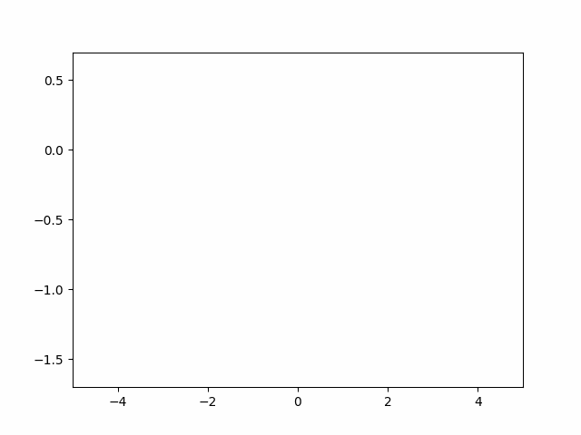
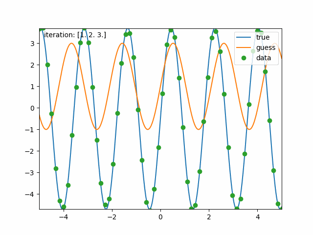
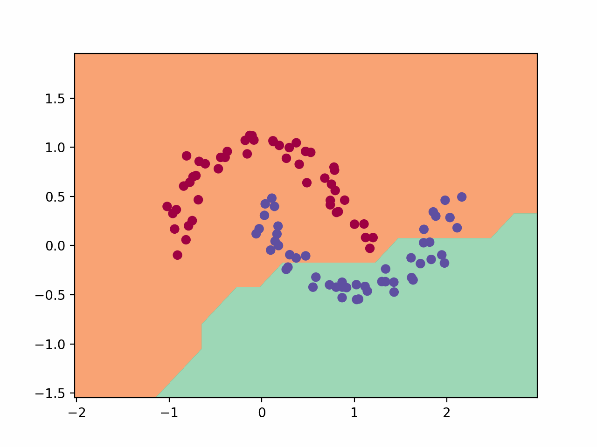
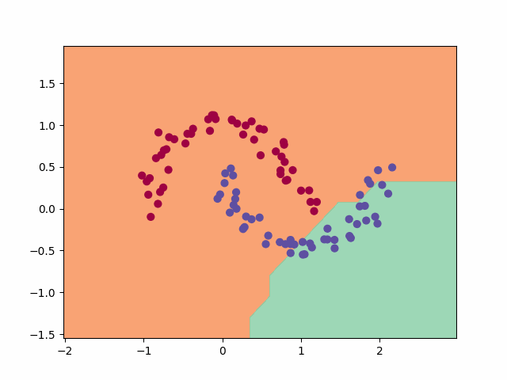
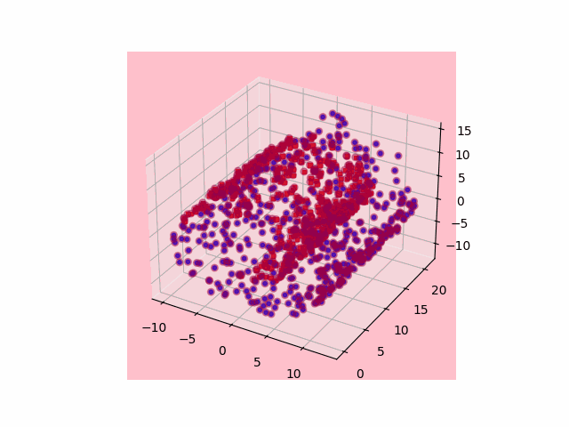

# Visual ML

<div style="text-align: center;">
    
</div>

This project's aim was to build and train foundational ML models from the ground up. The resulting code is applied to toy datasets, and visualization tools are used to see the algorithms as they progress!

<div style="text-align: center;">
    
     
</div>

The first GIF above shows a sinusoidal function, which is one of the toy datasets used in this project. The second GIF shows the progress of the gradient descent algorithm, which is used to optimize the models.

These images were genereted using the scripts in the `GradDesc` directory.

<div style="text-align: center;">
    <figure>
        
        <figcaption>Micrograd NN Training</figcaption>
    </figure>
    <figure>
        
        <figcaption>PyTorch NN Training</figcaption>
    </figure>
</div>

The two GIFs above show the training process of two different neural networks. The first one is trained using the Micrograd library, and the second one is trained using PyTorch.

The Micrograd framework in this project was largely inspired by [Andrej Karpathy](https://github.com/karpathy/micrograd/tree/master)'s project. 

run `micrograd_animations.py` and `pytorch_animation.py` to obtain the above results.

<div style="text-align: center;">
    
</div>

The GIF above shows a 3D visualization of a PyTorch neural network training process. This visualization helps to understand how the model learns to separate the data into different categories.

run `pytorch_3d_animation.py` to obtain this last plot.

## Getting Started

To get started with this project, you'll need to install the required libraries. You can do this by running the following command:

```bash
pip install -r requirements.txt
```

## More
- `GradDesc` has the mine code for learning and playing around with the gradient descent algorithm. This was the first step of the project.
- `micrograd.py` contains the enginge behind NNs. These are much slower than Pytorch's own implementation, but the code is useful for learning and tinkering.
- `colabs` contains some extra scripts for generating visualizations based on the project's code.
- `visual-ml/results` contains some visualizations obtained from exploration in the `GradDesc` and `colabs` directories.